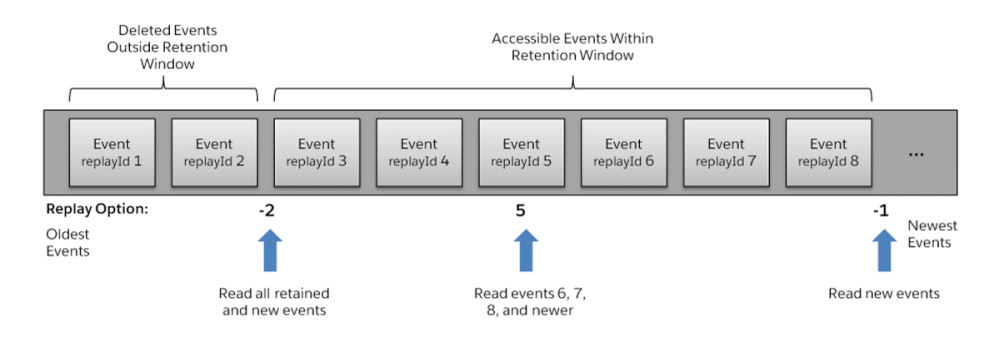

Advanced Usage
==============

.. py:currentmodule:: aiosfstream

.. _replay_config:

Replay configuration
--------------------

Salesforce stores events for 24 hours. Events outside the 24-hour retention
period are discarded.

ReplayOption
~~~~~~~~~~~~

A subscriber can choose which events to receive, such as all events within
the retention window or starting after a particular event. In the
:py:obj:`Client` object this can be specified with the ``replay`` parameter.
The default is to receive only the new events sent after subscribing, the
default ``replay`` parameter is :py:obj:`ReplayOption.NEW_EVENTS`

This high-level diagram shows how event consumers can read a stream of events
by using various replay options.

If you want to receive all events within the retention window every time the
:py:obj:`Client` connects, before receiving new events, then the
:py:obj:`ReplayOption.ALL_EVENTS` value should be passed to the
:py:obj:`Client`.

.. code-block:: python

    async with SalesforceStreamingClient(
                    consumer_key="<consumer key>",
                    consumer_secret="<consumer secret>",
                    username="<username>",
                    password="<password>",
                    replay=ReplayOption.ALL_EVENTS) as client:

         await client.subscribe("/topic/foo")

                async for message in client:
                    # process message

ReplayMarkerStorage
~~~~~~~~~~~~~~~~~~~

Although using a fixed :py:obj:`ReplayOption` can be sometimes useful, the
real advantage of using Salesforce's replay_ extension comes from being able
to continue to process event messages from the point where the client left off.
To take advantage of this feature, all you have to do is to
pass an object capable of storing the most recent :py:obj:`ReplayMarker` for
every channel.

Salesforce extends the event messages with ``repalyId`` and ``createdDate``
fields (called as :py:obj:`ReplayMarker` by aiosfstream).

The simplest way is to pass an object for the ``replay`` parameter that
inherits from :py:obj:`collections.abc.MutableMapping`. This can be a simple
:py:obj:`dict`, :py:obj:`~collections.OrderedDict` or if you want to use
persistent storage then a :py:obj:`~shelve.Shelf` object, or maybe one of the
key-value database drivers that inherit from
:py:obj:`collections.abc.MutableMapping`.

.. code-block:: python

        with shelve.open("replay.db") as replay:

            async with SalesforceStreamingClient(
                consumer_key="<consumer key>",
                consumer_secret="<consumer secret>",
                username="<username>",
                password="<password>",
                replay=replay) as client:

                await client.subscribe("/topic/foo")

                async for message in client:
                    # process message

By using a :py:obj:`collections.abc.MutableMapping` object, the client on the
first connection will receive only new events, and on reconnection will
continue from the last unretrieved message. If you want to receive all events
from the retention window before continuing with new events, combined with the
advantage of continuation on the next reconnect, then you can pass a
:py:obj:`DefaultMappingStorage` object to the ``replay`` parameter.

.. code-block:: python

        with shelve.open("replay.db") as replay:

            default_mapping = DefaultMappingStorage(
                replay,
                ReplayOption.ALL_EVENTS
            )

            async with SalesforceStreamingClient(
                consumer_key="<consumer key>",
                consumer_secret="<consumer secret>",
                username="<username>",
                password="<password>",
                replay=default_mapping) as client:

                await client.subscribe("/topic/foo")

                async for message in client:
                    # process message

If you want complete control over how :py:obj:`ReplayMarkers <ReplayMarker>`
are stored and retrieved or you want to use your favorite database whose
driver doesn't inherit from :py:obj:`collections.abc.MutableMapping` then
you can provide your own :py:obj:`ReplayMarkerStorage` implementation.

.. code-block:: python

        class MyReplayMarkerStorage(ReplayMarkerStorage):
            async def set_replay_marker(self, subscription, replay_marker):
                # store *replay_marker* for the given *subscription*

            async def get_replay_marker(self, subscription):
                # retrieve the replay marker for the given *subscription*

        replay = MyReplayMarkerStorage()

        async with SalesforceStreamingClient(
            consumer_key="<consumer key>",
            consumer_secret="<consumer secret>",
            username="<username>",
            password="<password>",
            replay=replay) as client:

            await client.subscribe("/topic/foo")

            async for message in client:
                # process message

Subscription errors
~~~~~~~~~~~~~~~~~~~

Events outside the 24-hour retention period are discarded. If you're using some
form of :py:obj:`ReplayMarkerStorage` or a
:py:obj:`~collections.abc.MutableMapping` object, and if you're client doesn't
connects to the Streaming API for more then 24 hours, then it's possible that
the client will try to continue retrieving messages from a very old message
outside the retention window. Since Salesforce no longer has the event message
that the client would try to retrieve, it would raise
:py:obj:`~exceptions.ServerError`.

.. code-block:: python

    try:
        await client.subscribe("/topic/foo")
    except ServerError as error:
        print(error.error_message)

The above code would print the following message, if the client would request
and event outside the retention window::

    The replayId {1} you provided was invalid.  Please provide a valid ID, -2
    to replay all events, or -1 to replay only new events.

To recover from an error like the above, you would have to discard the
:py:obj:`ReplayMarker` for the problematic channel, and try to subscribe again.

.. code-block:: python

    try:
        await client.subscribe("/topic/foo")
    except ServerError as error:
        del replay["/topic/foo"]
        await client.subscribe(/topic/foo")

To spare you the hassle of recovering from errors like the one above, you can
pass a :py:obj:`ReplayOption` for the ``replay_fallback`` parameter. If a
subscription error occurs, then :py:obj:`Client` will try to resubscribe using
the specified :py:obj:`ReplayOption`.

.. code-block:: python

        with shelve.open("replay.db") as replay:

            async with SalesforceStreamingClient(
                consumer_key="<consumer key>",
                consumer_secret="<consumer secret>",
                username="<username>",
                password="<password>",
                replay=replay,
                replay_fallback=ReplayOption.ALL_EVENTS) as client:

                await client.subscribe("/topic/foo")

                async for message in client:
                    # process message

Network failures
----------------

When a :py:obj:`Client` object is opened, it will try to maintain a continuous
connection in the background with the server. If any network failures happen
while waiting to :py:meth:`~Client.receive` messages, the client will reconnect
to the server transparently, it will resubscribe to the subscribed channels,
and continue to wait for incoming messages.

To avoid waiting for a server which went offline permanently, or in case of a
permanent network failure, a ``connection_timeout`` can be passed to the
:py:obj:`Client`, to limit how many seconds the client object should wait
before raising a :py:obj:`~exceptions.TransportTimeoutError` if it can't
reconnect to the server.

.. code-block:: python

    client = SalesforceStreamingClient(
        consumer_key="<consumer key>",
        consumer_secret="<consumer secret>",
        username="<username>",
        password="<password>",
        connection_timeout=60
    )
    await client.open()

    try:
        message = await client.receive()
    except TransportTimeoutError:
        print("Connection is lost with the server. "
              "Couldn't reconnect in 60 seconds.")

The defaul value is ``10`` seconds. If you pass ``None`` as the
``connection_timeout`` value, then the client will keep on trying indefinitely.

Prefetching
-----------

When a :py:obj:`Client` is opened it will start and maintain a connection in
the background with the server. It will start to fetch messages from the
server as soon as it's connected, even before :py:meth:`~Client.receive` is
called.

Prefetching messages has the advantage, that incoming messages will
wait in a buffer for users to consume them when :py:meth:`~Client.receive`
is called, without any delay.

To avoid consuming all the available memory by the incoming messages, which are
not consumed yet, the number of prefetched messages can be limited with the
``max_pending_count`` parameter of the :py:obj:`Client`. The default value is
``100``.

.. code-block:: python

    client = SalesforceStreamingClient(
        consumer_key="<consumer key>",
        consumer_secret="<consumer secret>",
        username="<username>",
        password="<password>",
        max_pending_count=42
    )

The current number of messages waiting to be consumed can be obtained from the
:py:obj:`Client.pending_count` attribute.

.. include:: global.rst
